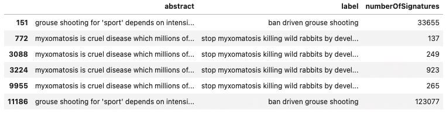
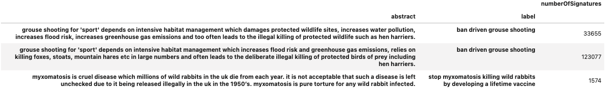

# Observation:
There are multiple labels having the same title.
 

Among these duplicated titles, some of them have the same abstract and others have different abstracts.


### Assumption: <br>
If multiple records have the same label and abstract, the same petition was proposed or revisited several times, 
I think we should treat them as a single petition and grouping the number of signatures together.
If multiple records have the same label but different abstract, they should be treated differently.

# Project Structure
- data - contains the raw data (not included in this repo) <br>
- image - contains supporting images <br>
- execution - main scripts, python or pyspark
- output_artefacts_{pyspark|python}_run - contains the output data and reusable artefacts <br>
- preprocessing - contains the project main codes <br>
- tests - contains unit tests <br>

### Run Processing
This repo provides two execution modes to get the required results. <br>
- Python execution with pandas and swifter
- Pyspark execution with pyspark
```bash
bash bash_run.sh python # process with python
# or
bash bash_run.sh pyspark # process with pyspark
```

### Processing Logic
1. Load raw data
2. Basic preprocessing
   1. Remove nested data structure.
   2. Convert text to lower cases.
   3. Remove punctuations and whitespaces.
   4. [optional] convert words to their base formats - lemmatisation.
3. If two records have the same label and abstract, treat them as a signal petition (update numberOfSignatures)
4. Calculate label and abstract length for each record.
   1. Sort records based on numberOfSignatures in the descending order.
   2. Reset index and name it as petition_id.
5. Save required output1.csv file.
6. Build lookup table (which contains word-frequency pairs).
   1. Save lookup table.
7. Get top_k (=20) most common words across all petitions.
   1. Includes both label and abstract columns.
   2. Only counts words with 5 or more letters.
8. For each record, count the appearance of the top_k words.
9. Save required output2.csv file.

### Future optimization
The lookup table can be computed along with basic preprocessing step.


